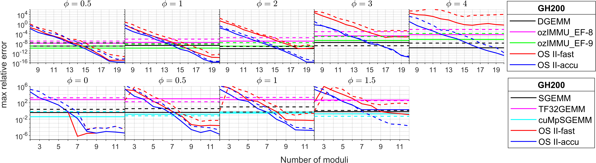
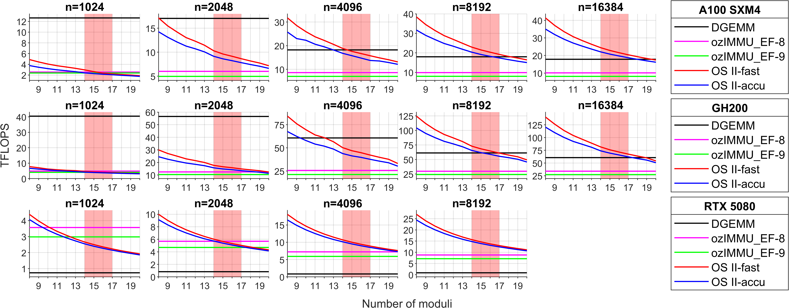
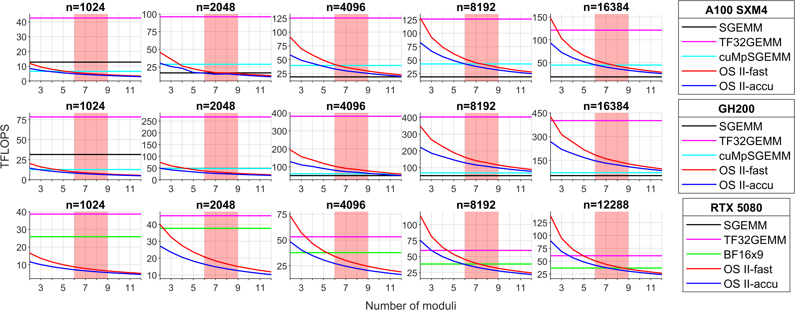
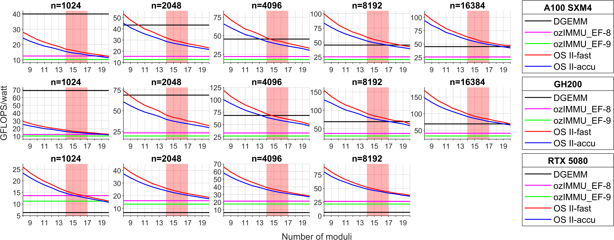
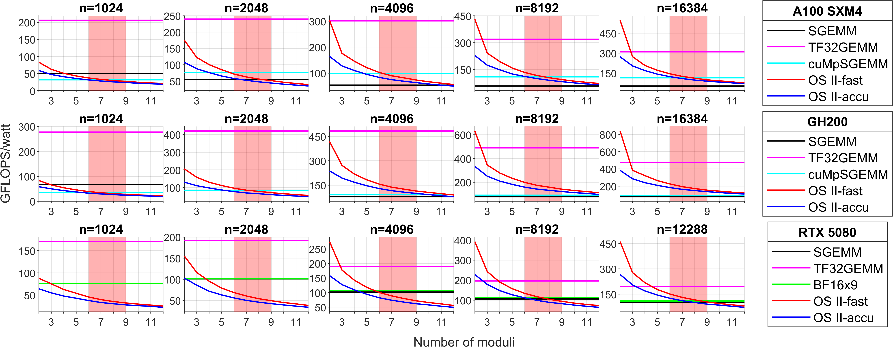

# GEMMul8<!-- omit in toc -->

GEMMul8 (GEMMulate): GEMM emulation using int8 matrix engines based on the Ozaki Scheme II

- [Build](#build)
- [Attention](#attention)
- [Usage](#usage)
  - [1. Direct Usage (normal)](#1-direct-usage-normal)
  - [2. Hijack cuBLAS GEMM (Hook Mode)](#2-hijack-cublas-gemm-hook-mode)
- [Numerical results](#numerical-results)
  - [Environments](#environments)
  - [Accuracy](#accuracy)
  - [Throughput performance](#throughput-performance)
  - [Power efficiency](#power-efficiency)
  - [Supplementary Experiment](#supplementary-experiment)
- [Acknowledgment](#acknowledgment)
- [Contact](#contact)
- [References](#references)
- [Citations](#citations)
- [License](#license)

## Build

1. (Option) Build `cuMpSGEMM` and `ozIMMU_EF` according to [cuMpSGEMM](https://github.com/enp1s0/cuMpSGEMM) and [ozIMMU](https://github.com/enp1s0/ozIMMU) (see also [Accelerator for ozIMMU](https://github.com/RIKEN-RCCS/accelerator_for_ozIMMU)).

2. Navigate to the `GEMMul8` directory and modify the following values in the `Makefile` and `testing/Makefile` to the appropriate values:

   - `CUDA_PATH`: path to cuda (e.g., `CUDA_PATH := /usr/local/cuda`)
   - `ozIMMU_EF`: `yes` if the ozIMMU_EF is used in sample codes (e.g., `ozIMMU_EF := yes`)
   - `ozIMMU_EF_DIR`: path to ozIMMU_EF (e.g., `ozIMMU_EF_DIR := path/to/ozIMMU_EF`)
   - `cuMpSGEMM`: `yes` if the cuMpSGEMM is used in sample codes (e.g., `cuMpSGEMM := yes`)
   - `cuMpSGEMM_DIR`: path to cuMpSGEMM (e.g., `cuMpSGEMM_DIR := path/to/cuMpSGEMM`)
   - `hijack`: `yes` if you are hijacking cublasGemmEx with emulation (e.g., `hijack := yes`)
   - Note: Please specify `ozIMMU_EF_DIR` and `cuMpSGEMM_DIR` as the parent directories of `build` directories, i.e., `build` directories are located as `ozIMMU_EF_DIR/build` and `cuMpSGEMM_DIR/build`.

3. Run `make` in the `GEMMul8` directory to compile all files.

4. (Option) Navigate to the `testing` directory and then run following commands to run sample codes.
   - `make test_f MODE="mode1 mode2 ..."` (testrun for SGEMM emulation)
   - `make test_d MODE="mode1 mode2 ..."` (testrun for DGEMM emulation)
   - mode list:
     - `accuracy`: Tests the numerical accuracy
     - `flops`: Measures the performance (square matrices)
     - `watt`: Measures the power consumption (square matrices)
     - `flops_rect`: Measures the performance (rectangular matrices)
     - `watt_rect`: Measures the power consumption (rectangular matrices)
     - `all`
   - Example:
     - `make test_f MODE="watt"`
     - `make test_d MODE="accuracy flops flops_rect"`
     - `make test_f test_d MODE="all"`

## Attention

- ozIMMU_EF is taken from [ozIMMU](https://github.com/enp1s0/ozIMMU) by Ootomo and [Accelerator for ozIMMU](https://github.com/RIKEN-RCCS/accelerator_for_ozIMMU) by RIKEN R-CCS.
- cuMpSGEMM is taken from [cuMpSGEMM](https://github.com/enp1s0/cuMpSGEMM) by Ootomo.
- If you use these libraries, you must comply with their license terms in addition to the license for this code.

## Usage

This library provides two ways to use the GEMM emulation:

### 1. Direct Usage (normal)

This approach does not override cuBLAS; you call your custom functions explicitly.

```
//----------
// settings
//----------
const unsigned num_moduli = 14;   // 2 <= num_moduli <= 20 for DGEMM emulation
// const unsigned num_moduli = 6;   // 2 <= num_moduli <= 18 for SGEMM emulation
const bool fastmode = true;       // true (fast mode) or false (accurate mode)

//----------
// (if needed) allocate workspace
//----------
const size_t worksize = gemmul8::workSize(m,n,k,num_moduli);
void *work;
cudaMalloc(&work, worksize);

//----------
// (if needed) output variable
//----------
std::vector<double> time_breakdown(4,0);

//----------
// run emulation
// gemmul8::gemm returns execution time (sec.) of each part
//----------
time_breakdown = gemmul8::gemm(cublas_handle,   // Handle to the cuBLAS library context
                               CUBLAS_OP_N,     // non- or transpose devA
                               CUBLAS_OP_N,     // non- or transpose devB
                               m,               // Number of rows of devC
                               n,               // Number of columns of devC
                               k,               // Inner dimension
                               &alpha,          // Scaling factor for devA*devB
                               devA,            // 1-D device array of dimensions lda*k (CUBLAS_OP_N) or lda*m (CUBLAS_OP_T)
                               lda,             // Leading dimension of devA
                               devB,            // 1-D device array of dimensions ldb*n (CUBLAS_OP_N) or ldb*k (CUBLAS_OP_T)
                               ldb,             // Leading dimension of devB
                               &beta,           // Scaling factor for devC
                               devC,            // 1-D device array of dimensions ldc*n
                               ldc,             // Leading dimension of devC
                               num_moduli,      // #moduli (controlling accuracy)
                               fastmode,        // Computing mode
                               work);           // workspace
```

### 2. Hijack cuBLAS GEMM (Hook Mode)

The library can automatically intercept calls to cuBLAS GEMM functions (cublasSgemm, cublasDgemm, cublasGemmEx) and redirect them to the emulation:

```
export LD_PRELOAD=/path/to/libgemmul8.so
export NUM_MODULI=15
export FASTMODE=1
```

- `NUM_MODULI` (default: `18`)
  - Specifies the number of moduli `unsigned num_moduli` used in the GEMM emulation.
- `FASTMODE` (default: `1`)
  - Enables fast mode in the GEMM emulation. If `FASTMODE=1`, `bool fastmode = true;`, otherwise, `bool fastmode = false;`.

The hook mode works transparently: existing calls to cuBLAS GEMM will use the emulation.

You can switch back to standard cuBLAS by not setting LD_PRELOAD.

## Numerical results

The constant $\phi$ controls the difficulty of matrix multiplication (exponent distribution of input matrices).
The difficulty of $\phi = 0.5$ is comparable to that of matrix multiplication in HPL.

### Environments

- an NVIDIA Ampere A100 SXM4 GPU with an AMD EPYC 7713 CPU , CUDA Toolkit 12.9.86, and gcc 11.5.0
- an NVIDIA GH200 Grace Hopper Superchip with CUDA Toolkit 12.9.86, and gcc 11.5.0
- an NVIDIA GeForce RTX 5080 Blackwell GPU with an AMD Ryzen 9 7950X CPU, CUDA Toolkit 12.9.86, and gcc 11.5.0
- an NVIDIA B200 Blackwell GPU with an Intel Xeon Platinum 8570 CPU, CUDA Toolkit 12.8.93, and gcc 13.3.0

### Accuracy


_Accuracy of DGEMM (top) and SGEMM (bottom) emulation for $m=n=1024$ on GH200. Solid lines represent results for $k=1024$, and dashed lines for $k=16384$._

### Throughput performance


_Throughput performance of DGEMM emulation on A100 (top), GH200 (middle), and RTX 5080 (bottom)._


_Throughput performance of SGEMM emulation on A100 (top), GH200 (middle), and RTX 5080 (bottom)._

### Power efficiency


_Power efficiency of DGEMM emulation on A100 (top), GH200 (middle), and RTX 5080 (bottom)._


_Power efficiency of SGEMM emulation on A100 (top), GH200 (middle), and RTX 5080 (bottom)._

### Supplementary Experiment

- On B200, native DGEMM achieved 36.0 TFLOPS, whereas fast mode and accurate mode with 14--17 moduli achieved 98.9--123 TFLOPS and 92.5--110 TFLOPS, respectively, for emulating DGEMM for $m=n=k=16384$.

- On B200, native SGEMM achieved 67.2 TFLOPS, whereas fast mode with 7--9 moduli and accurate mode with 6--8 moduli achieved 197--259 TFLOPS and 194--240 TFLOPS, respectively, for emulating SGEMM for $m=n=k=16384$.

## Acknowledgment

Assistance with debugging the code was provided by:

- Patrick Gutsche
  - École Normale Supérieure de Lyon, France
  - Intern at RIKEN Center for Computational Science, Japan
- Prajval Kumar
  - School of Chemistry, Indian Institute of Science and Education Research (IISER), Thiruvananthapuram
  - Intern at RIKEN Center for Computational Science, Japan
- Dr. William Dawson
  - RIKEN Center for Computational Science, Japan

Assistance with experiments on the NVIDIA B200 Blackwell GPU, courtesy of Prof. Rio Yokota (Institute of Science Tokyo), was provided by:

- Dr. Qianxiang Ma
  - RIKEN Center for Computational Science, Japan

**Please do not contact the individuals listed above regarding this code.**

## Contact

- Yuki Uchino (responsible developer)
  - RIKEN Center for Computational Science, Japan
  - yuki.uchino.fe (at) riken.jp

## References

- Hiroyuki Ootomo and Rio Yokota. 2022. Recovering single precision accuracy from Tensor Cores while surpassing the FP32 theoretical peak performance. The International Journal of High Performance Computing Applications 36, 4 (2022), 475--491.
- Hiroyuki Ootomo, Hidetaka Manabe, Kenji Harada, and Rio Yokota. 2023. Quantum Circuit Simulation by SGEMM Emulation on Tensor Cores and Automatic Precision Selection. In High Performance Computing. Springer Nature Switzerland, Cham, 259--276.
- Hiroyuki Ootomo, Katsuhisa Ozaki, and Rio Yokota. 2024. DGEMM on integer matrix multiplication unit. The International Journal of High Performance Computing Applications 38, 4 (2024), 297--313.
- Yuki Uchino, Katsuhisa Ozaki, and Toshiyuki Imamura. 2025. Performance enhancement of the Ozaki Scheme on integer matrix multiplication unit. The International Journal of High Performance Computing Applications 39, 3 (2025), 462--476.

## Citations

```
@misc{ozaki2025ozakischemeiigemmoriented,
      title={Ozaki Scheme II: A GEMM-oriented emulation of floating-point matrix multiplication using an integer modular technique},
      author={Katsuhisa Ozaki and Yuki Uchino and Toshiyuki Imamura},
      year={2025},
      eprint={2504.08009},
      archivePrefix={arXiv},
      primaryClass={cs.MS},
      url={https://arxiv.org/abs/2504.08009},
}

@misc{uchino2025highperformancepowerefficientemulationmatrix,
      title={High-Performance and Power-Efficient Emulation of Matrix Multiplication using INT8 Matrix Engines},
      author={Yuki Uchino and Katsuhisa Ozaki and Toshiyuki Imamura},
      year={2025},
      eprint={2508.03984},
      archivePrefix={arXiv},
      primaryClass={cs.DC},
      url={https://arxiv.org/abs/2508.03984},
}

and

TBD
```

## License

MIT
