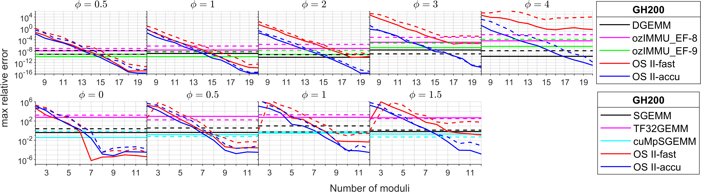

# GEMMul8<!-- omit in toc -->

GEMMul8 (GEMMulate): GEMM emulation using int8 matrix engines based on Ozaki Scheme II

GEMMul8 (GEMMulate) is a library for emulating high-precision matrix multiplication (SGEMM/DGEMM) using low-precision INT8 matrix engines.
It is based on the Ozaki Scheme II, enabling bit-wise reproducible results with superior performance and power efficiency compared to native floating-point implementations.

- [Technical Overview](#technical-overview)
- [Build](#build)
  - [make options](#make-options)
  - [Note](#note)
  - [Example](#example)
    - [CUDA build](#cuda-build)
    - [HIP build](#hip-build)
  - [External Dependencies and Licenses](#external-dependencies-and-licenses)
- [Running Sample Codes](#running-sample-codes)
  - [How to Run](#how-to-run)
  - [make options](#make-options-1)
  - [Example](#example-1)
- [Usage](#usage)
  - [1. Direct Usage (Normal mode)](#1-direct-usage-normal-mode)
    - [Example: run emulation for the CUDA backend](#example-run-emulation-for-the-cuda-backend)
    - [Arguments of `gemmul8::gemm`](#arguments-of-gemmul8gemm)
  - [2. Hijack cuBLAS/hipBLAS GEMM (Hook Mode)](#2-hijack-cublashipblas-gemm-hook-mode)
    - [Interception target](#interception-target)
    - [How to enable the hook](#how-to-enable-the-hook)
    - [Configure emulation parameters via environment variables](#configure-emulation-parameters-via-environment-variables)
- [Numerical results](#numerical-results)
  - [Environments](#environments)
  - [Accuracy](#accuracy)
  - [Throughput performance](#throughput-performance)
  - [Power efficiency](#power-efficiency)
  - [Supplementary Experiment on a B200](#supplementary-experiment-on-a-b200)
- [Acknowledgment](#acknowledgment)
  - [Assistance with debugging](#assistance-with-debugging)
  - [Assistance with experiments on a B200 GPU](#assistance-with-experiments-on-a-b200-gpu)
- [Contact (Responsible Developer)](#contact-responsible-developer)
- [References](#references)
- [Citations](#citations)
- [License](#license)

## Technical Overview

GEMMul8 implements GEMM emulation based on Ozaki scheme II, which utilizes the Chinese Remainder Theorem (CRT).
A larger number of moduli (`num_moduli`) for the CRT results in higher precision at the cost of increased computation time.

This project supports both **CUDA** and **HIP** backends for GPU computation.

The GEMM emulation ensures bit-wise numerical reproducibility.
This is achieved through a combination of exact, error-free computations and a fixed order of operations.

However, please note that this reproducibility guarantee may not extend to environments using different toolkits or compilers.
Discrepancies can arise from varying propagation rules for Inf/NaN values or differences in the precision of underlying math library functions.

## Build

Run `make` in the `GEMMUl8/GEMMul8` directory to compile all source files.

```bash
make -j8
```

To rebuild from scratch, run `make clean && make -j8`.

### make options

| Option          | Default           | Description                                                                                           |
| :-------------- | :---------------- | :---------------------------------------------------------------------------------------------------- |
| `CUDA_PATH`     | `/usr/local/cuda` | Path to your CUDA toolkit installation. Used for CUDA backends.                                       |
| `HIP_PATH`      | `/opt/rocm`       | Path to your HIP (ROCm) toolkit installation. Used for HIP backends.                                  |
| `BACKEND`       | `auto`            | Select GPU backend: `cuda`, `hip`, or `auto` (auto-detect).                                           |
| `GPU_ARCH`      | `auto`            | Target GPU architecture.<br>Examples: `80` (A100), `90` (H100), `gfx90a` (MI250X), `gfx942` (MI300X). |
| `ozIMMU_EF`     | `no`              | Set to `yes` to use ozIMMU in the sample code.                                                        |
| `ozIMMU_EF_DIR` | `../../ozIMMU_EF` | Path to ozIMMU implementation. Used if `ozIMMU_EF=yes`.                                               |
| `cuMpSGEMM`     | `no`              | Set to `yes` to use cuMpSGEMM in the sample code.                                                     |
| `cuMpSGEMM_DIR` | `../../cuMpSGEMM` | Path to cuMpSGEMM. Used if `cuMpSGEMM=yes`.                                                           |
| `HIJACK`        | `no`              | Set to `yes` to hijack cuBLAS GEMM calls with emulation in the sample code.                           |

### Note

- If you enable optional modules (ozIMMU_EF=yes, cuMpSGEMM=yes), please clone and build their repositories first.
  - [cuMpSGEMM - CUDA Mutable-precision SGEMM](https://github.com/enp1s0/cuMpSGEMM)
  - [ozIMMU - DGEMM on Int8 Tensor Core](https://github.com/enp1s0/ozIMMU)
  - See also [Accelerator for ozIMMU](https://github.com/RIKEN-RCCS/accelerator_for_ozIMMU)
- `BACKEND=auto` will attempt to detect your GPU vendor automatically.
- `GPU_ARCH=auto` will automatically detect and use the appropriate compute capability or architecture for your GPU.
- Target GPU architecture can be found from e.g., [NVIDIA GPU CC](https://developer.nvidia.com/cuda-gpus) or [AMD hardware specs](https://rocm.docs.amd.com/en/latest/reference/gpu-arch-specs.html).

### Example

#### CUDA build

Build for an NVIDIA H100/H200 GPU (Compute Capability 9.0)

```bash
make -j8 BACKEND=cuda CUDA_PATH=/usr/local/cuda GPU_ARCH=90
```

#### HIP build

Build for an AMD MI300X GPU (gfx942 architecture)

```bash
make -j8 BACKEND=hip HIP_PATH=/opt/rocm GPU_ARCH=gfx942
```

### External Dependencies and Licenses

- ozIMMU_EF is derived from [ozIMMU](https://github.com/enp1s0/ozIMMU) by Ootomo and [Accelerator for ozIMMU](https://github.com/RIKEN-RCCS/accelerator_for_ozIMMU) by RIKEN R-CCS.
- cuMpSGEMM is derived from [cuMpSGEMM](https://github.com/enp1s0/cuMpSGEMM) by Ootomo.
- If you use these libraries, please ensure compliance with their respective license terms.

## Running Sample Codes

After building the project, you can run sample codes from the testing directory.

### How to Run

Navigate to the `testing` directory and use `make` to run tests for different precisions.

### make options

| Mode     | Value        | Description                                                     |
| :------- | :----------- | :-------------------------------------------------------------- |
| `test_f` | (no)         | Tests for SGEMM                                                 |
| `test_d` | (no)         | Tests for DGEMM                                                 |
| `MODE`   | `accuracy`   | Tests numerical accuracy (maximum element-wise relative error). |
|          | `flops`      | Measures TFLOPS with square matrices.                           |
|          | `watt`       | Measures watt and GFLOPS/watt with square matrices.             |
|          | `flops_rect` | Measures TFLOPS with rectangular matrices.                      |
|          | `watt_rect`  | Measures watt and GFLOPS/watt with rectangular matrices.        |
|          | `all`        | Runs all available test modes.                                  |

### Example

```bash
# Run accuracy test (DGEMM)
make test_d MODE="accuracy"
```

```bash
# Run all tests (SGEMM)
make test_f MODE="all"
```

```bash
# Run accuracy, flops, & watt tests (SGEMM & DGEMM)
make test_f test_d MODE="accuracy flops watt"
```

## Usage

This library provides two ways to use the GEMM emulation.

### 1. Direct Usage (Normal mode)

Call GEMMul8 functions explicitly from your source code.
This gives you fine-grained control over the emulation parameters.

#### Example: run emulation for the CUDA backend

```cpp
#include "gemmul8.hpp"

// 1. Create a handle to the cuBLAS library context
cublasHandle_t cublas_handle;
cublasCreate(&cublas_handle);

// 2. Settings
const unsigned num_moduli = 14u;  // Accuracy knob: 2 <= num_moduli <= 20
const bool fastmode = true;       // true (fast mode) or false (accurate mode)

// 3. Allocate workspace
const size_t worksize = gemmul8::workSize(m,n,k,num_moduli); // calculate required memory (Byte)
void *work;
cudaMalloc(&work, worksize);

// 4. (Optional) Create a vector to store timing breakdown
std::vector<double> time_breakdown(4, 0.0);

// 5. Run emulation
// The function returns a vector with execution times for each phase.
time_breakdown = gemmul8::gemm(cublas_handle,
                               CUBLAS_OP_N, CUBLAS_OP_N,
                               m, n, k,
                               &alpha, devA, lda,
                               devB, ldb,
                               &beta, devC, ldc,
                               num_moduli, fastmode, work);

// 6. Free workspace
cudaFree(work);
```

#### Arguments of `gemmul8::gemm`

The arguments for `gemmul8::gemm` closely match the standard [cublas&lt;t&gt;gemm](https://docs.nvidia.com/cuda/cublas/#cublas-t-gemm) and [hipblasXgemm](https://rocm.docs.amd.com/projects/hipBLAS/en/develop/reference/hipblas-api-functions.html#hipblasxgemm-batched-stridedbatched) interfaces, with the addition of `num_moduli`, `fastmode`, and `work`.

| Argument     | Type             | Description                                                                  |
| :----------- | :--------------- | :--------------------------------------------------------------------------- |
| `num_moduli` | `const unsigned` | Number of moduli (controls accuracy). `2 <= num_moduli <= 20`.               |
| `fastmode`   | `const bool`     | Enables fast computation mode (`true` = fast mode, `false` = accurate mode). |
| `work`       | `void* const`    | Pointer to preallocated workspace.                                           |

### 2. Hijack cuBLAS/hipBLAS GEMM (Hook Mode)

Intercept standard GEMM calls automatically without modifying the application source code.

#### Interception target

- `cublasSgemm_v2`, `cublasDgemm_v2`, `cublasGemmEx`
- `hipblasSgemm`, `hipblasDgemm`, `hipblasGemmEx_v2`

#### How to enable the hook

1. Build the library.
2. Set the `LD_PRELOAD` environment variable.

```bash
export LD_PRELOAD=/path-to-GEMMul8/lib/libgemmul8.so
```

3. Run your application.

#### Configure emulation parameters via environment variables

```bash
export NUM_MODULI_D=15
export FASTMODE_D=1
export NUM_MODULI_S=7
export FASTMODE_S=0
```

| Variable       | Default | Applies to | Description                                                                          |
| :------------- | :------ | :--------- | :----------------------------------------------------------------------------------- |
| `NUM_MODULI_D` | `18`    | DGEMM      | Number of moduli (`unsigned num_moduli`) used in DGEMM emulation. Controls accuracy. |
| `NUM_MODULI_S` | `8`     | SGEMM      | Number of moduli used in SGEMM emulation. Controls accuracy.                         |
| `FASTMODE_D`   | `0`     | DGEMM      | Enables fast mode (`1` = fast mode, `0` = accurate mode).                            |
| `FASTMODE_S`   | `0`     | SGEMM      | Enables fast mode (`1` = fast mode, `0` = accurate mode).                            |

You can also set these environment variables programmatically from within your code using setenv.

```cpp
char num_moduli[12];

// Run emulation with num_moduli = 15 & fastmode = true
snprintf(num_moduli, sizeof(num_moduli), "%u", 15u);
setenv("NUM_MODULI_D", num_moduli, 1);
setenv("FASTMODE_D", "1", 1);
cublasDgemm_v2(...);

// Run emulation with num_moduli = 18 & fastmode = false
snprintf(num_moduli, sizeof(num_moduli), "%u", 18u);
setenv("NUM_MODULI_D", num_moduli, 1);
setenv("FASTMODE_D", "0", 1);
cublasDgemm_v2(...);
```

## Numerical results

The constant $\phi$ controls the difficulty of matrix multiplication (exponent distribution of input matrices).
The difficulty of $\phi = 0.5$ is comparable to that of matrix multiplication in HPL.

### Environments

- NVIDIA A100 SXM4 GPU with an AMD EPYC 7713 CPU , CUDA Toolkit 12.9.86, and gcc 11.5.0
- NVIDIA GH200 Grace Hopper Superchip with CUDA Toolkit 12.9.86, and gcc 11.5.0
- NVIDIA GeForce RTX 5080 GPU with an AMD Ryzen 9 7950X CPU, CUDA Toolkit 12.9.86, and gcc 11.5.0
- NVIDIA B200 GPU with an Intel Xeon Platinum 8570 CPU, CUDA Toolkit 12.8.93, and gcc 13.3.0

### Accuracy


_Accuracy of DGEMM (top) and SGEMM (bottom) emulation for $m=n=1024$ on GH200. Solid lines represent results for $k=1024$, and dashed lines for $k=16384$._

### Throughput performance


_Throughput performance of DGEMM emulation on A100 (top), GH200 (middle), and RTX 5080 (bottom)._


_Throughput performance of SGEMM emulation on A100 (top), GH200 (middle), and RTX 5080 (bottom)._

### Power efficiency


_Power efficiency of DGEMM emulation on A100 (top), GH200 (middle), and RTX 5080 (bottom)._


_Power efficiency of SGEMM emulation on A100 (top), GH200 (middle), and RTX 5080 (bottom)._

### Supplementary Experiment on a B200

- $m=n=k=16384$
- DGEMM:
  - Native DGEMM: 36.0 TFLOPS
  - Emulation (Fast Mode, 14-17 moduli): 98.9-123 TFLOPS
  - Emulation (Accurate Mode, 14-17 moduli): 92.5-110 TFLOPS
- SGEMM:
  - Native SGEMM: 67.2 TFLOPS
  - Emulation (Fast Mode, 7-9 moduli): 197--259 TFLOPS
  - Emulation (Accurate Mode, 6-8 moduli): 194--240 TFLOPS

## Acknowledgment

**Please do not contact the individuals listed below regarding this code.**

### Assistance with debugging

- Patrick Gutsche (École Normale Supérieure de Lyon, France)
- Prajval Kumar (Indian Institute of Science and Education Research, India)
- Dr. William Dawson (RIKEN Center for Computational Science, Japan)
- Dr. Toshiyuki Imamura (RIKEN Center for Computational Science, Japan)

(Affiliations as of 2025)

### Assistance with experiments on a B200 GPU

- Dr. Qianxiang Ma (RIKEN Center for Computational Science, Japan)
- Prof. Rio Yokota (Institute of Science Tokyo, Japan)

(Affiliations as of 2025)

## Contact (Responsible Developer)

- Yuki Uchino (RIKEN Center for Computational Science, Japan)
- yuki.uchino.fe (at) riken.jp

## References

- Ootomo, H., & Yokota, R. (2022). Recovering single precision accuracy from Tensor Cores while surpassing the FP32 theoretical peak performance. The International Journal of High Performance Computing Applications, 36(4), 475-491, [doi.org/10.1177/10943420221090256](https://doi.org/10.1177/10943420221090256).
- Ootomo, H., Manabe, H., Harada, K., & Yokota, R. (2023). Quantum Circuit Simulation by SGEMM Emulation on Tensor Cores and Automatic Precision Selection. In High Performance Computing (pp. 259-276). Springer, [doi.org/10.1007/978-3-031-32041-5_14](https://doi.org/10.1007/978-3-031-32041-5_14).
- Ootomo, H., Ozaki, K., & Yokota, R. (2024). DGEMM on integer matrix multiplication unit. The International Journal of High Performance Computing Applications, 38(4), 297-313, [https://doi.org/10.1177/10943420241239588](https://doi.org/10.1177/10943420241239588).
- Uchino, Y., Ozaki, K., & Imamura, T. (2025). Performance enhancement of the Ozaki Scheme on integer matrix multiplication unit. The International Journal of High Performance Computing Applications, 39(3), 462-476, [doi.org/10.1177/10943420241313064](https://doi.org/10.1177/10943420241313064).

## Citations

```
@misc{ozaki2025ozakischemeiigemmoriented,
      title={Ozaki Scheme II: A GEMM-oriented emulation of floating-point matrix multiplication using an integer modular technique},
      author={Katsuhisa Ozaki and Yuki Uchino and Toshiyuki Imamura},
      year={2025},
      eprint={2504.08009},
      archivePrefix={arXiv},
      primaryClass={cs.MS},
      url={https://arxiv.org/abs/2504.08009},
}

@misc{uchino2025highperformancepowerefficientemulationmatrix,
      title={High-Performance and Power-Efficient Emulation of Matrix Multiplication using INT8 Matrix Engines},
      author={Yuki Uchino and Katsuhisa Ozaki and Toshiyuki Imamura},
      year={2025},
      eprint={2508.03984},
      archivePrefix={arXiv},
      primaryClass={cs.DC},
      url={https://arxiv.org/abs/2508.03984},
}

and

TBD
```

## License

This project is licensed under the MIT License. See the LICENSE file for details.
